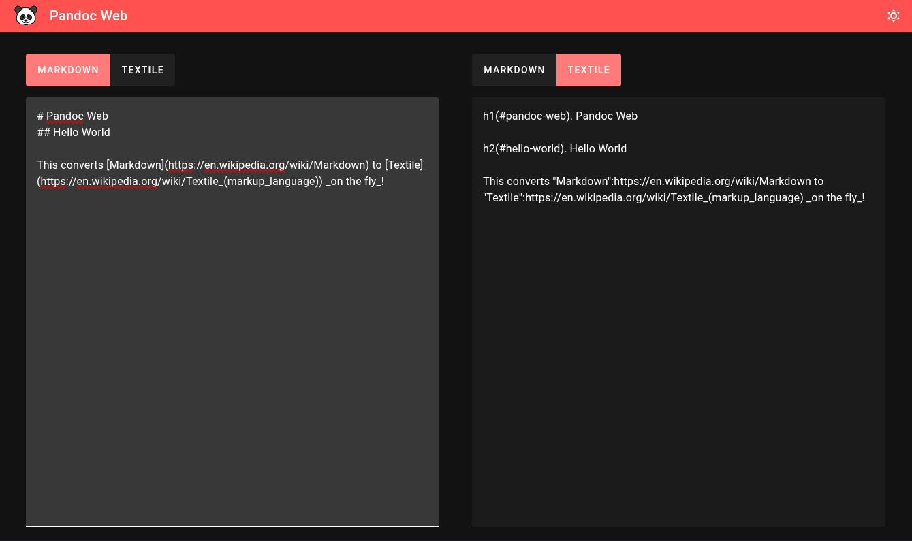

# Pandoc Web

This project aims to create a web interface for the [Pandoc](https://pandoc.org) command line tool to make it more accessible and easier to use.
Instead of having to use the command line, it provides a simple-to-use web interface that automatically updates on change.



## Docker image

You can run this via Docker using the published package:

```shell
docker run --rm -p 8080:8080 ghcr.io/synyx/pandocweb:latest
```

You can now open the web interface locally on http://localhost:8080.

## Dev

First install all dependencies:

```shell
npm install
```

then run the application in dev mode:

```shell
npm run dev
```

You will be able to access the dev application on port `8081`.

## Building

Run:

```shell
npm run build
```

You will be able to start your application in the project root the following way:

```shell
node ./backend/src/main.js
```

The application will now be running on port `8080` and serve the frontend as well as the API.

Running the application expects Pandoc to be installed on your machine and be accessible with the configured `PATH` env variable.

## License

This project is licensed under the MIT license.
The panda icon is by OpenMoji – the open-source emoji and icon project. License: CC BY-SA 4.0
