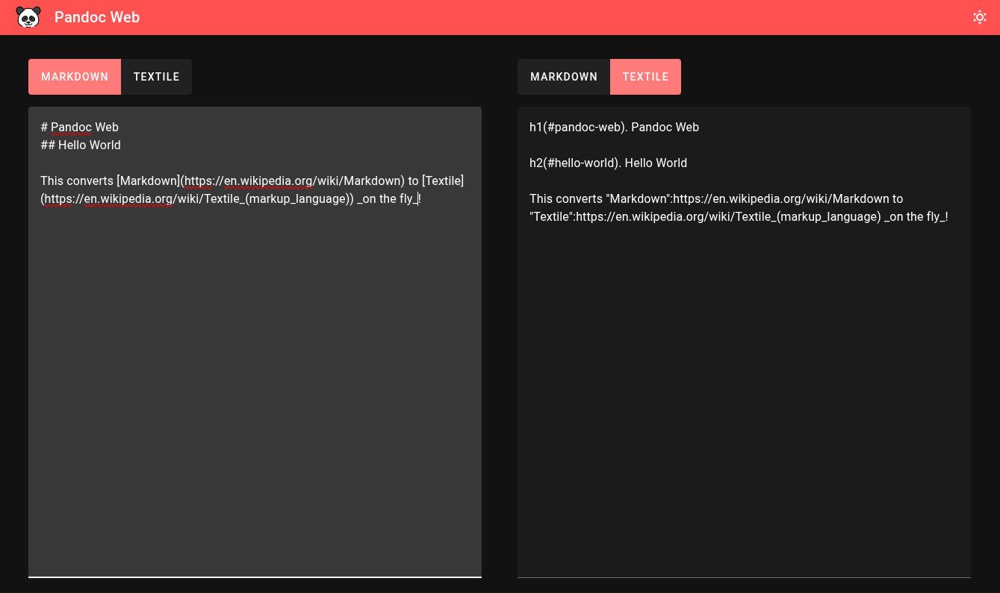

# Pandoc Web

This project aims to create a web interface for the [Pandoc](https://pandoc.org) command line tool to make it more accessible and easier to use.
Instead of having to use the command line, it provides a simple-to-use web interface that automatically updates on change.



Pandoc is fully run in your browser via [WebAssembly](https://webassembly.org/index.html) and [pandoc-wasm](https://github.com/pandoc/pandoc-wasm).
No data is leaving your browser.

Use it here (hosted via GitHub pages): https://synyx.github.io/pandoc-web/
Or use the container image to self-host it.

## Container image

A container image is provided to be able to self-host the tool.
You can run this e.g. via Docker using the published package:

```shell
docker run --rm -p 8080:80 ghcr.io/synyx/pandocweb:latest
```

You can now open the web interface locally on http://localhost:8080.

## Dev

First install all dependencies:

```shell
pnpm install
```

then run the application in dev mode:

```shell
pnpm dev
```

You will be able to access the dev application on port `5173` (by default).
Otherwise, the console will log the port.

## Building

Run:

```shell
pnpm build
```

## License

This project is licensed under the MIT license.
The panda icon is by OpenMoji – the open-source emoji and icon project. License: CC BY-SA 4.0
